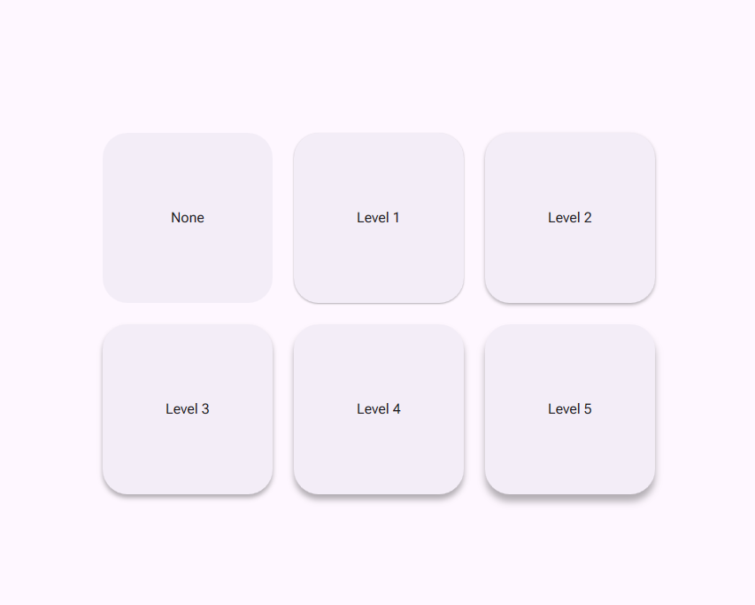
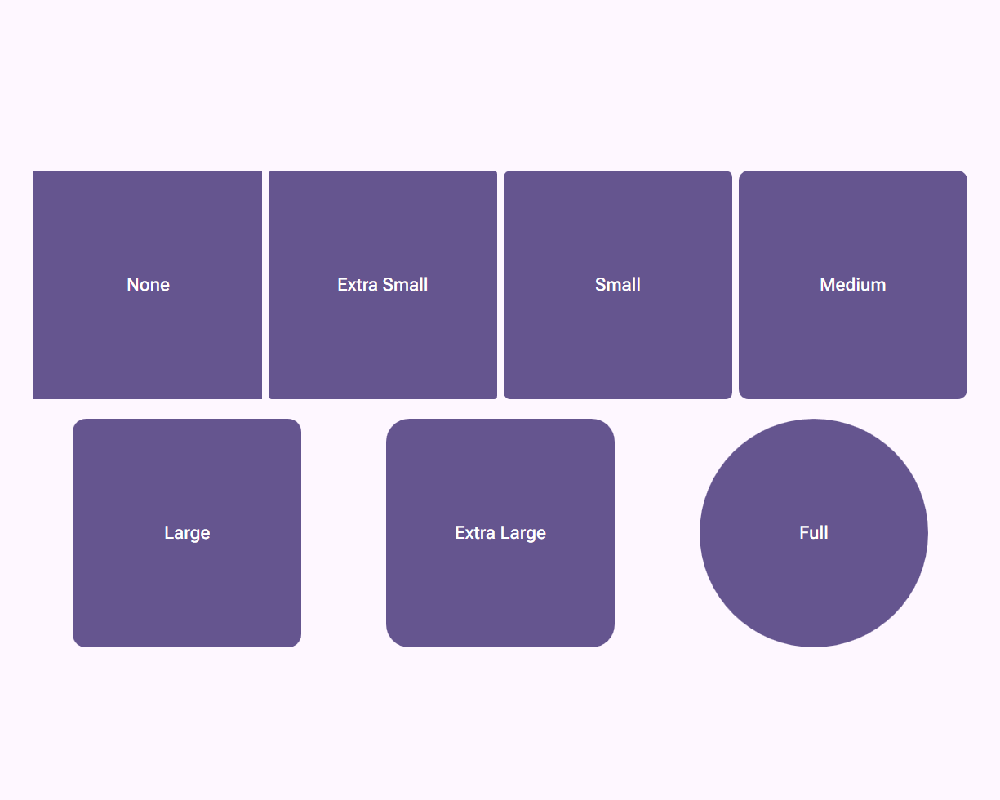
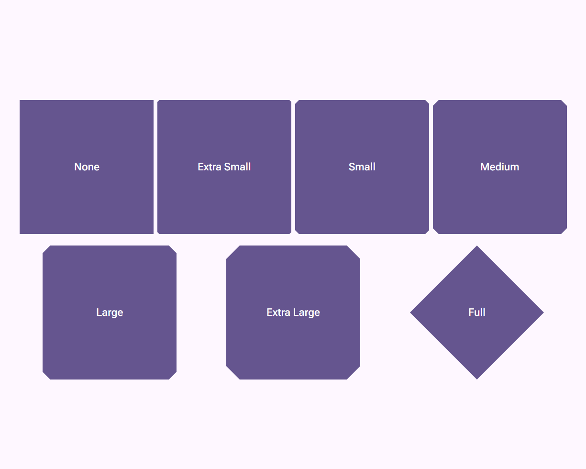
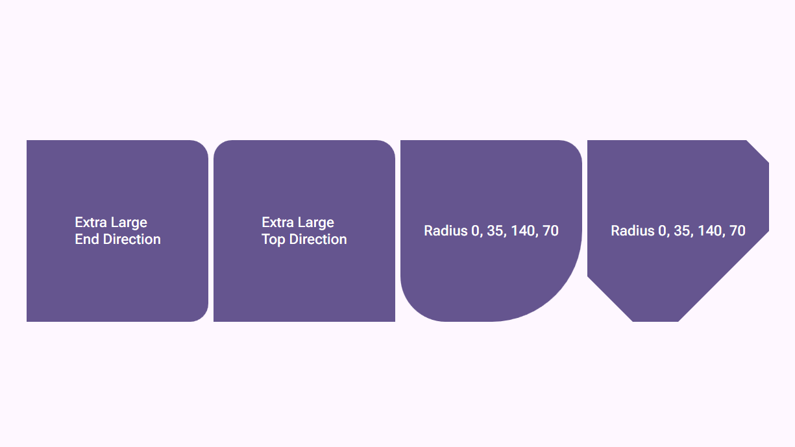
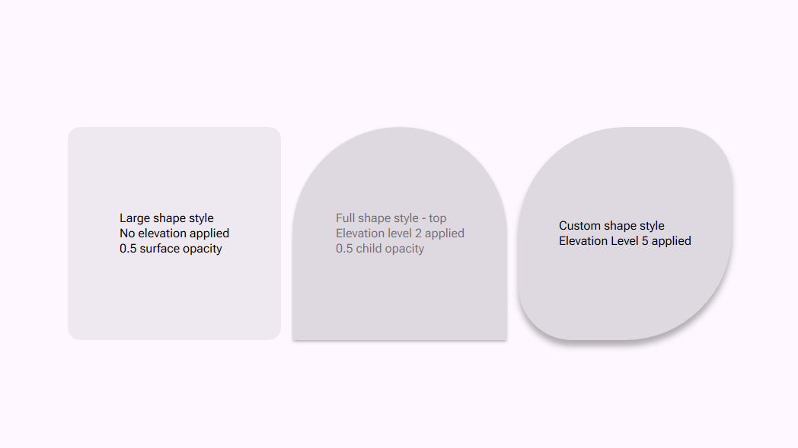
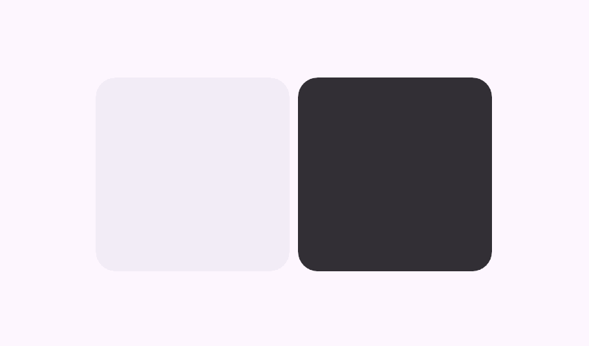
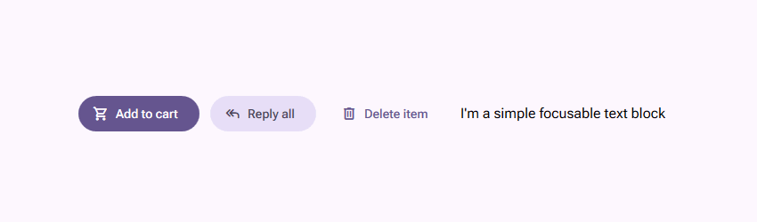

# Material Components for WPF

**Bringing [Google's Material Design 3 (M3)](https://m3.material.io/) to Windows Presentation Foundation (WPF).**

**Material Components for WPF** is a powerful and flexible UI library that enables developers to build visually stunning
and modern WPF applications that align with Google's Material Design 3 guidelines. This library provides a comprehensive
set of components, styles, and utilities designed to elevate your app's user experience and design.

> ⚠️ Note: This project is currently under development, and many features are still in progress.

✨ Key Features

- 🎯 **Material Design 3 Compliance:**
Fully aligned with **Google’s Material Design 3** guidelines for a modern, consistent UI/UX.

- ♦️ **Material Symbols Support:**
Seamless access to **[Google's Material Symbols](https://fonts.google.com/icons)**, including support for rounded, 
outlined, and sharp icon styles.

- 🎨 **Customizable & Theming:**
Easily customize components with support for contrasted light and dark themes, color palettes, typography, and more.

- 📃 **Comprehensive Documentation:**
Clear and detailed documentation makes it easy to get started and explore advanced features.

## 🚀 Getting started

### Requirements

The library currently targets .NET 8 and .NET 9.

### From NuGet

> ⚠️ Note: The library is currently under development and is not yet available on NuGet. Once it's ready, you’ll be 
> able to install it via NuGet with a simple command like this:

```bash
dotnet add package Material.Components.WPF
````

### Clone Locally

To explore the library:

```bash
git clone https://github.com/pedrior/material-components-wpf.git
cd material-components-wpf
```

After cloning the repository, open the project in your favorite IDE (e.g., Visual Studio or Rider) and start exploring 
the available components and features.

## 📚 Documentation

The library's documentation is currently available in-code.

## 🎨 Styles

Styles define the visual aspects of your UI, giving it a distinct look and feel while maintaining consistency across 
your application. They are essential for creating a cohesive and professional design that aligns with M3 principles.

### 🎨 Color

The color system in Material Components for WPF allows you to define primary, secondary, surface, background, error 
colors, and more. It Supports light and dark themes, high-contrast accessibility options, and customizable palettes.

### 🎚️ Elevation

Elevation adds depth to your UI by applying shadow effects, creating a clear visual hierarchy.

Example:



### ♦️ Icons

Seamless integration with Google Material Symbols provides access to thousands of icons in three variants: **rounded**,
**outlined**, and **sharp**.

### 🌀 Motion

> ⚠️ Note: Motion is currently under development. By now, the library only implements M3 motion curves and
> defines duration constants.

### 🎭 Shape

Shapes defines the geometry of components, providing a consistent visual language across your application. The library
supports **rounded** and **cut** shape families, as well as custom shapes.

Example:

- **Rounded**: for curved corners, such as circles or ovals.



- **Cut**: for angular corners, such as squares with chamfered edges.



- **Custom**: for custom shapes, such as custom radii or directional corners.



### 📏 Typography

> ⚠️ Note: Typography is currently under development.

## 🧩 Components

The library provides a rich set of UI elements, building blocks, and utilities that enable
developers to create stunning applications adhering to M3 guidelines.

### 🔗 Building blocks

Building blocks are fundamental elements that serve as the foundation for more complex components.

#### **Container**

The **Container** is a stylized element that acts as a versatile building block. It supports:

- Shape customization.
- Elevation levels to define depth.
- Color customizations and layering.

Example:



#### **Ripple**

The **Ripple** provides visual feedback for user interactions by displaying a circular wave animation that 
expands outward from the interaction point.

Example:



#### **State Layer**:

The **State Layer** visually communicates the current state of a component, such as hovered, pressed, or dragged.
It enhances interactivity and accessibility by overlaying a semi-transparent color to indicate hover or pressed states.

#### **Focus Indicator**:

The **Focus Indicator** is a key accessibility element that highlights components currently in focus (via keyboard 
navigation or other interactions). It includes:

- A visual outline around the focused element to guide users.
- Full support for custom shapes, color, thickness, and padding.

Example:



### 🌟 Built-in Components

> ⚠️ Note: Components are currently under development.

## 🤝 Contributing

We welcome contributions to help improve and expand Material Components for WPF!

Here’s how you can contribute:

1. Fork the repository.
2. Create a new branch for your feature or bug fix.
3. Submit a pull request describing your changes.

If you encounter any issues or have ideas for improvements, feel free to open an issue in the repository.

## 📫 Contact

Have questions or feedback? Feel free to reach out at:\
📧 pedrojdev@gmail.com

You can also open an issue on the [GitHub repository](https://github.com/pedrior/material-components-wpf/issues) to 
share your thoughts!

## 📝 License

This project is licensed under the [MIT License](https://github.com/pedrior/material-components-wpf/blob/master/LICENSE).
Feel free to use, modify, and distribute the library in your own projects.